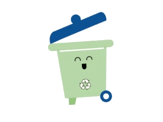
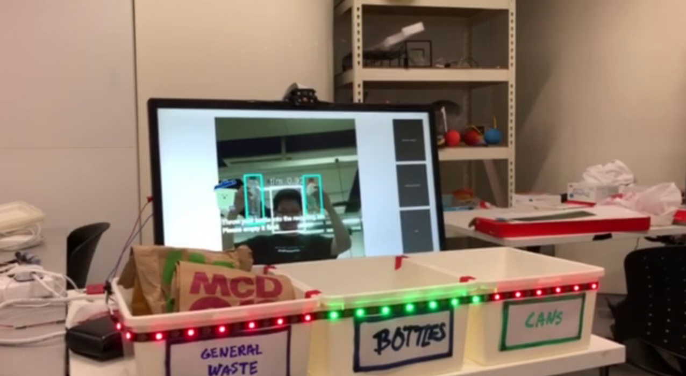
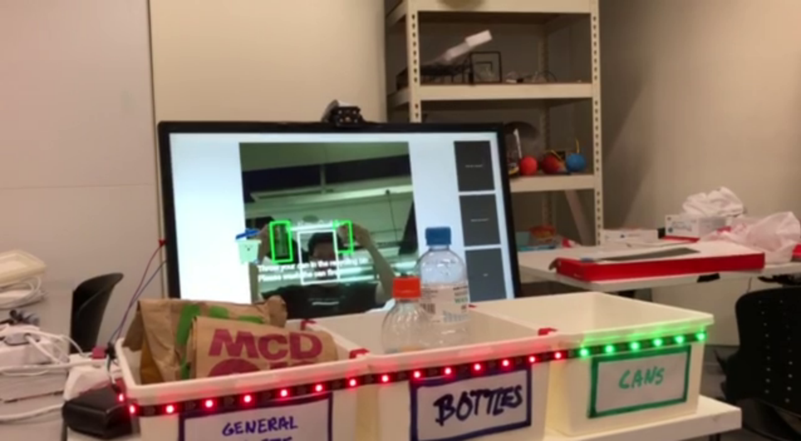
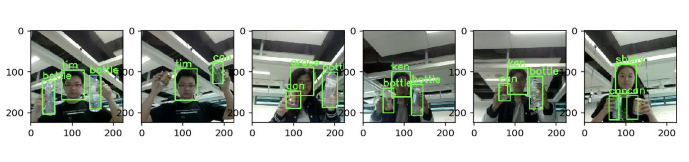

# Project SmartBin: Just Bin It!
**Spring 2018 - 10.009 Digital World 1D Project**

## Background

Statistics from the National Environmental Agency (NEA) has shown that Singapore’s domestic recycling rate has remained at a stagnant 20% over the years, despite almost a decade of recycling initiatives. This is a lot lower than the recycling rates of other countries, and NEA has the goal of increasing our recycling rate to 30% by 2030. We believe that as we progress towards being a smart nation, Singapore should be able to adopt technology to realize this goal.

In addition to the low recycling rates, this is the other main problem plaguing recycling. So not only are people NOT recycling what they could be, they’re recycling what they shouldn’t be. And it takes time and money to sort out the unsuitable objects after collection. 

> 30 to 50 per cent of materials deposited into the recycling bins are not suitable for recycling.
> 
> -- Dr Amy Khor, Senior Minister of State for the Environment and Water Resources

In addition to the low recycling rates, this is the other main problem plaguing recycling. So not only are people NOT recycling what they could be, they’re recycling what they shouldn’t be. And it takes time and money to sort out the unsuitable objects after collection. 

So we created a smarter recycling bin system for our project, that will tell residents everything they need to know about recycling, and hence motivate them to recycle more.

**Just Bin It with Trashy!**

## Design Process

We decided we need to make an effective and intuitive app to nudge people to recycle, and recycle correctly. Hence, we made a smart kiosk to be placed behind the standard row of recycling bins to indicate and encourage people to throw trash into the correct bin.

We decided on a vision-based system to detect what kind of trash people were about to throw, and then provide some tips and a visual indication on which bin is more suitable. An avatar, Trashy, also appears on the screen to attract user's attention and tries to encourage them to throw trash properly. 

In the above photo, the app has detected a user, Tim, holding two plastic bottles, and indicates where to throw them.

Same thing, but with two cans this time.

We made use of a open-source object detection framework to develop and implement the object detection functionality in our app. Along the way, we faced many challenges. We spent countless hours labelling a total of 1034 images, training our model, adjusting model and training parameters (including coefficients of the cost function) to the final result.

Our app will also record the person currently throwing the trash. While this function is still not properly implemented (as we weren't able to detect trash being thrown into the bin effectively), we will use this to record a person's tendency to throw crash correctly, and gamify the process by making this into a leaderboard.

Getting everything to run on a resource constraint device such as a Raspberry Pi was also challenging, and required careful consideration of the scale of the object detection model and the implementation of the app. We thus heavy use of Python libraries that were already optimised for performance (`numpy` and `OpenCV`) as far as possible, and used the `threading` library to maximise the potential of the app.

## FAQ

1. **What model are you using for object detection?**
  * We are using [MobileNet](https://arxiv.org/abs/1704.04861) as a feature extractor, followed by a version of the [SSD MultiBox Detector](https://arxiv.org/abs/1512.02325). The implementation was heavily based on work done by [experiencor](https://github.com/experiencor/keras-yolo2), who provided an initial base and framework for training and implementing object detection. We tweaked many parameters in order to get the result we wanted on our own dataset.
2. **What's the performance on a Raspberry Pi 3, and how did you get there?**
  1. We were able to get between 0.7 and 1.2FPS detection performance under ideal conditions. Due to multi-threading, we can run the video stream seperately at 20FPS (capped by design) to ensure a better user experience. This means that the bounding box tends to lag behind the video feed by about a second, but the video remains smooth.
  2. To optimise camera and image processing performance, we used a heavily optmised OpenCV binary compiled for Raspberry Pi, taking full advantage of NEON instruction sets etc. The camera capture is also run on a seperate thread, with the Raspberry Pi's VideoCore IV GPU performing the heavy lifting of re-sizing and flipping the camera image.
  3. The image processing and object detection pipeline is optimised to have as little pre-processing steps as possible, with the output from the camera capture being the exact input resolution for the MobileNet feature extractor.

## How to run (Raspberry Pi/Raspbian Stretch)

***Warning: if you don't have the dependencies already installed, this is going to take quite some time.***

1. Install standard dependencies: `sudo pip3 install -r requirements.txt`
2. Mount a USB drive to use as swap ([Guide](https://github.com/samjabrahams/tensorflow-on-raspberry-pi/blob/master/GUIDE.md#2-install-a-memory-drive-as-swap-for-compiling))
2. Compile and install OpenCV (oh no) (Shortcut: `curl https://raw.githubusercontent.com/tlkh/setup-cheatsheets/master/install_opencv.sh | sudo bash`) (Note: takes 2~3h)
3. Compile and install TensorFlow **r1.4** (oh no) ([Guide](https://github.com/samjabrahams/tensorflow-on-raspberry-pi/blob/master/GUIDE.md)) (Note: takes 6~7h)
4. Install [Kivy](https://kivy.org/docs/installation/installation-rpi.html)
5. Install [Neopixel library for Raspberry Pi](https://learn.adafruit.com/neopixels-on-raspberry-pi/software) (LED strip `DATA-IN` pin goes to `GPIO18`)
6. Run `sudo python3 SmartBinApp.py` (**run as root to enable LED strip control**)

Other Related Stuff:

* [Repository used for training](https://github.com/tlkh/keras-yolo2)

## Project Contributors

* Timothy Liu
* Chia Yew Ken
* Grace Tan
* Frank Lee
* Shuai Shuai

